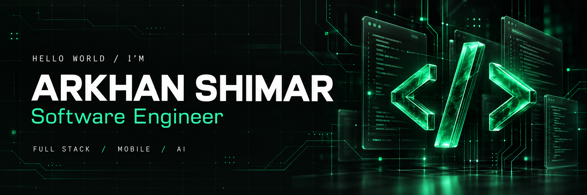
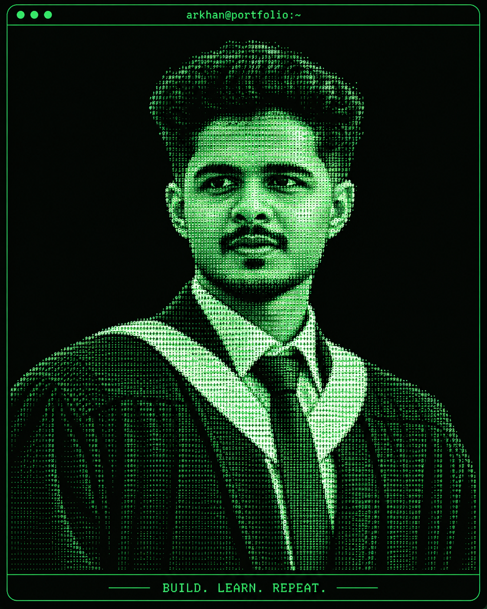
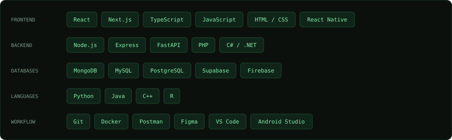
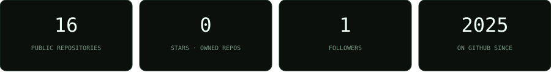
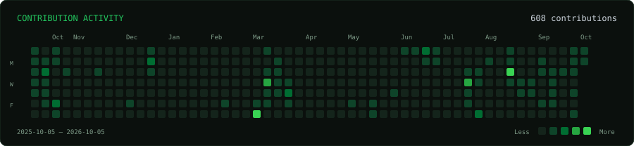
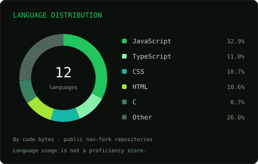
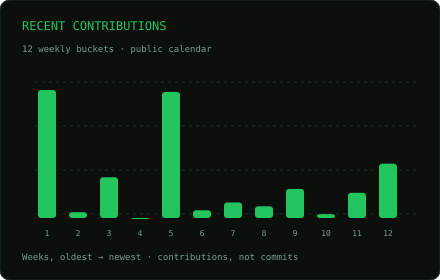
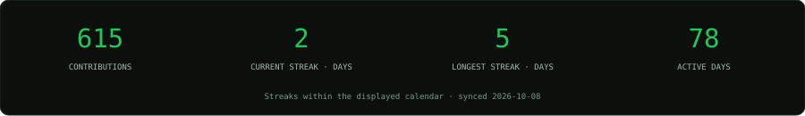

<p align="center">
  
</p>

<p align="center">
  <a href="https://arkhan-portfolio.vercel.app"></a>
  <a href="https://www.linkedin.com/in/arkhan-shimar-77b3072ab/"></a>
  <a href="mailto:arkhansimar1@gmail.com"></a>
  <a href="https://arkhan-portfolio.vercel.app/Arkhan_Shimar.pdf"></a>
</p>

<p align="center"><samp>FULL-STACK THINKING. CLEAN INTERFACES. REAL-WORLD PROBLEMS.</samp></p>

## 👨‍💻 About me

<table>
<tr>
<td width="58%" valign="top">

### Hey, I’m Arkhan.

A **Software Engineer & Computer Science undergraduate** based in **Mawanella, Sri Lanka**. I build web platforms and Android applications, and explore practical machine learning.

```js
const arkhan = {
  role: "Software Engineer",
  work: "SLT-MOBITEL · Intern",
  study: "BSc (Hons) Computer Science",
  focus: [
    "Full-stack development",
    "Android applications",
    "Intelligent systems"
  ],
  mindset: "Build. Learn. Repeat."
};
```

Outside the code: **freelance graphic design** and **mathematics tutoring**.

<a href="mailto:arkhansimar1@gmail.com"><strong>Let’s build something useful ↗</strong></a>

</td>
<td width="42%" align="center" valign="middle">
  
</td>
</tr>
</table>

## 🧰 Technology stack

<p align="center"></p>

## 📊 GitHub dashboard

<p align="center"></p>

<p align="center"></p>

<p align="center">
  
  
</p>

<p align="center"></p>

<p align="center"><sub>Public GitHub data · Last refreshed date appears on the cards · Languages reflect code volume, not proficiency.</sub></p>

## 🚀 Notable projects

<table>
<tr>
<td width="50%" valign="top">

### 🍽️ Veloura
Restaurant ordering, reservations, POS, kitchen display, and role-based operations.

`React` `Node.js` `Express` `MongoDB`

[Source ↗](https://github.com/ArkhanShimar/Restaurant-Website) · [Live demo ↗](https://veloura-restaurant-lk.vercel.app/)

</td>
<td width="50%" valign="top">

### ✅ DayMark
Task management with authentication, task creation, progress tracking, and notifications.

`React` `Node.js` `Express` `MongoDB`

[Source ↗](https://github.com/ArkhanShimar/Task-Management-System) · [Live demo ↗](https://task-management-system-frontend-seven.vercel.app/)

</td>
</tr>
<tr>
<td width="50%" valign="top">

### 📝 Notely
Rich-text notes, folders, pinning, real-time collaboration, and search.

`React` `Node.js` `MongoDB`

[Source ↗](https://github.com/ArkhanShimar/Note-Taking-Website)

</td>
<td width="50%" valign="top">

### 🧵 Textile ERP
Managing textile operations, from raw materials to finished goods.

`React` `Express` `PostgreSQL` `Supabase`

[Source ↗](https://github.com/ArkhanShimar/Textile_ERP)

</td>
</tr>
<tr>
<td width="50%" valign="top">

### 🏨 LuxeVista
Android hotel booking and service management application.

`Java` `Firebase` `Android`

[Source ↗](https://github.com/ArkhanShimar/LexeVista-Resort)

</td>
<td width="50%" valign="top">

### 🌱 AgroCare
Plant disease detection, growth prediction, and plant management using CNN and regression models.

`React` `FastAPI` `MongoDB` `Machine Learning`

[Portfolio ↗](https://arkhan-portfolio.vercel.app/projects) · Public source unavailable

</td>
</tr>
</table>

<p align="right"><a href="https://arkhan-portfolio.vercel.app/projects"><strong>Explore the full project archive →</strong></a></p>

## 🎓 Learning & experience

| Journey | Details |
| :--- | :--- |
| **Full Stack Developer Intern** | SLT-MOBITEL · August 2026–present |
| **Freelance Web Developer & Graphic Designer** | 2024–present |
| **BSc (Hons) Computer Science — Software Engineering** | CINEC Campus / University of Wolverhampton · 2026–present |
| **Higher Diploma in Computing and Software Engineering** | ICBT Campus / Cardiff Metropolitan University · 2024–2026 |

<details>
<summary><strong>🏅 Selected certifications</strong></summary>

<br/>

- [AWS Educate Machine Learning Foundations](https://www.credly.com/badges/045e744e-5f2e-4fc5-ae09-a8eba0b90047/linked_in_profile)
- [Postman API Fundamentals Student Expert](https://badges.parchment.com/public/assertions/gvXkOdi8SvaIyPAdn_Q9Ag)
- [Python Essentials 2 — Cisco](https://www.credly.com/badges/061c62f2-b2a6-4d18-b134-9c4ff39aece2/linked_in_profile)
- [JavaScript Essentials 2 — Cisco](https://www.credly.com/badges/813500e3-8f3f-4a0a-847a-691a33c8a226/linked_in_profile)

</details>

<details>
<summary><strong>✍️ Notes from the process</strong></summary>

<br/>

- [Why Most Student Projects Look the Same](https://arkhan-portfolio.vercel.app/blog/why-student-projects-look-the-same)
- [How I Use AI Tools Without Letting Them Do Everything](https://arkhan-portfolio.vercel.app/blog/how-i-use-ai-tools-without-letting-them-do-everything)
- [Lessons I Learned While Building My Own Projects](https://arkhan-portfolio.vercel.app/blog/lessons-i-learned-building-my-own-projects)

</details>

---

<p align="center"><samp>IDEA → CODE → SOMETHING USEFUL</samp><br/><br/><a href="mailto:arkhansimar1@gmail.com"><strong>Start a conversation ↗</strong></a></p>
